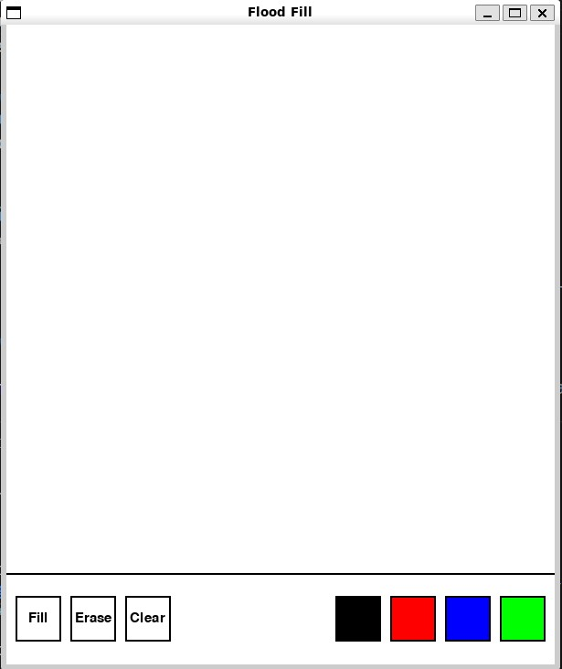
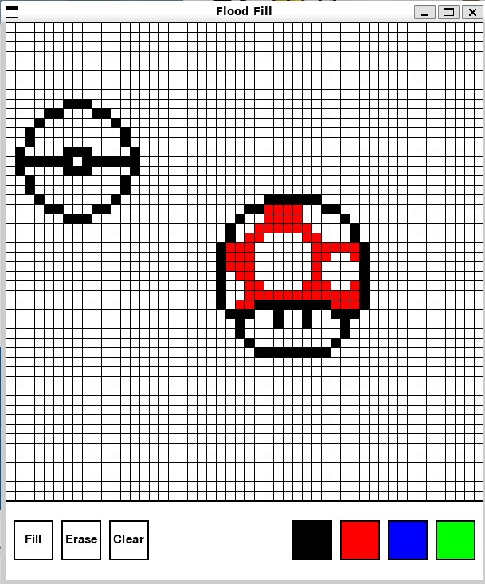
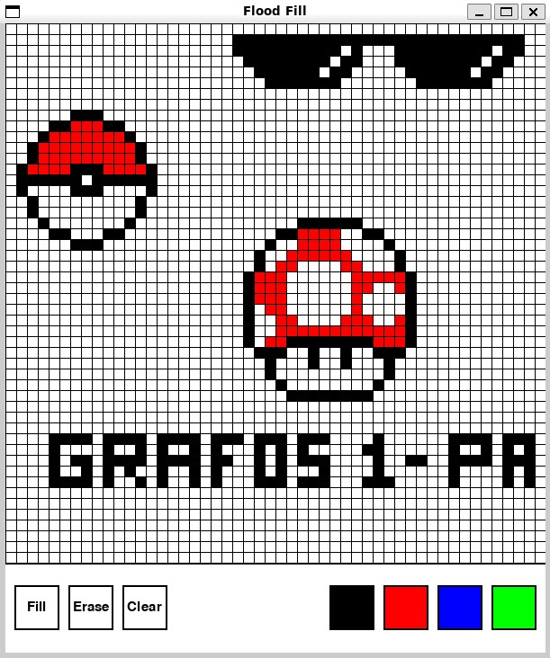

# Flood Fill

**Número da Lista**: X<br>
**Conteúdo da Disciplina**: Grafos1<br>

## Alunos
|Matrícula | Aluno |
| -- | -- |
| 190015721  |  Júlio César Martins França |

## Sobre 
Foi utilizada a biblioteca [Pygame](https://www.pygame.org/news) para a crição de uma ferramenta para desenhos simplificada. A ferramenta possui as seguintes funcionalidades:
- Ferramenta para desenhar
- Ferramenta para preencher o desenho
- Ferramenta para limpar a tela
- Ferramenta para apagar partes do desenho
- Seleção de cores

## Screenshots




## Instalação 
**Linguagem**: Python<br>
**library**: Pygame<br>

### Instalação do Python3 Linux
Link para a [documentação oficial](https://python.org.br/instalacao-linux/) do Python que ensina a como instalar o python em um sistema Linux.

Link para a [documentação oficial](https://www.pygame.org/wiki/GettingStarted) que ensina a instalar a biblioteca Pygame utilizada neste projeto.

Após instalar as ferramentas necessárias, utilize o comando abaixo dentro da pasta que contém o arquivo main.py para rodar o projeto:
```
Python3 main.py
```

## Uso 
- Ao abrir rodar o projeto a ferramenta para desenhar já estará selecionada por padrão
- Para mudar a cor da ferramenta de desenho basta clicar em uma das cores disponíveis
- Para utilizar a ferramenta de preenchimento siga os seguintes passos:
  1. Selecione a cor desejada para o preenchimento
  2. Clique na opção 'Fill'
  3. Clique na área que deseja preencher
  4. Após preencher a área selecionada o programa voltará para a ferramenta de desenho por padrão.
- Para limpar a tela clique na opção 'Clear'
- Para apagar partes do desenho selecione a opção 'Erase'
- Para ativar o grid, vá no arquivo settings.py e mude o valor da variável DRAW_GRID_LINES de False para True
```
DRAW_GRID_LINES = True
```


